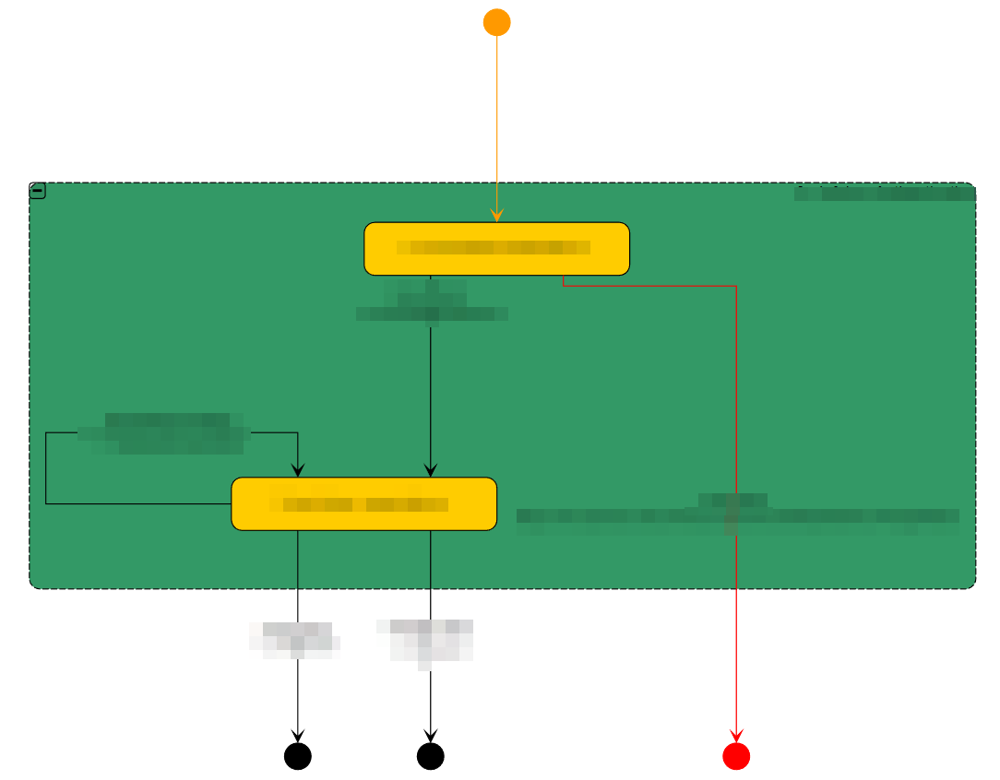
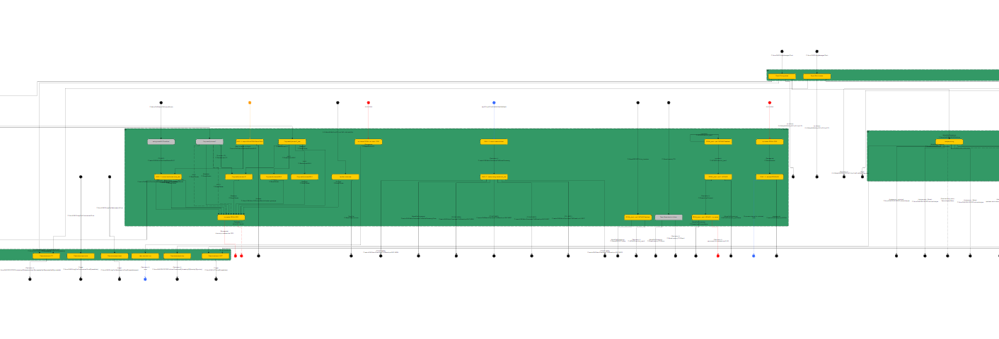

# Usage

1. Take full Mirth configuration export, place in the 'in' folder.  
2. Run `mirth-to-yed.ps1` to generate a Yed diagram (xgml format), additionally, run `yed-to-md.ps1` to generate a list of channel groups, channel names and descriptions in markdown format.  
3. Open the xgml in Yed, auto organise the elements, 'one-click-layout''gives the best result.  

# Background
## Mirth to Yed conversion

1. Loop through channel groups, create group elements.  
2. Loop through channels, create nodes, keep in and outputs as variables.
3. Loop through the in- and output variables, generate edges and assign to correct nodes based on matching on folders and channel ID's.

On creation of a new group, node or edge the necessary xml tags are copied from yed_template.xgml and adapted, and placed placed in yed_template_blank.xgml.

(See comments in ps1 for detailed breakdown)

## Mirth to markdown conversion

1. Loops through the channel groups.
2. Loops through the channels, takes name and description.
3. channels are matched to their channel groups and saved as a single string in the ou/*.md file.

# Examples

